<br>
<div align="center">
</img>
<h2></h2>
<h3>A Comprehensive Benchmark of Structural Pruning<h3>

</div>

<p align="center">
  <a href="https://opensource.org/licenses/MIT"></a>
  <a href="http://pruning.vipazoo.cn/">
  
</a>
  <a href="https://arxiv.org/abs/2301.12900" target="_blank"></a>
</p>


[[Platform & Tutorials of PruningBench](http://pruning.vipazoo.cn/)]

PruningBench is a comprehensive benchmark of structural pruning with the following features:


* **Unified Evaluation Framework:** PruningBench employs a unified framework to evaluate existing diverse structural pruning techniques, ensuring more equitable and comprehensible comparisons.
* **Leaderboards**: PruningBench systematically evaluates 16 existing structural pruning methods, encompassing a wide array of models (ResNet18, ResNet50, VGG19, ViT, YOLOv8) and tasks (classification on CIFAR and ImageNet, detection on COCO). PruningBench has now yielded 13 leaderboards and a handful of interesting findings which are not explored previously.  
* **Interfaces**: PruningBench is designed as an expandable package that standardizes experimental settings and eases the integration of new algorithmic implementations. PruningBench provides straightforward interfaces for implementing importance criteria methods and sparsity regularizers, facilitating the development and evaluation of future pruning algorithms. 


For more technical details, please refer to our paper:
> [**PruningBench: A Comprehensive Benchmark of Structural Pruning**](TBD)   
> *Haoling Li, Changhao Li, Mengqi Xue, Gongfan Fang, Sheng Zhou, Zunlei Feng, Huiqiong Wang, Yong Wang, Lechao Cheng, Mingli Song, Jie Song*
> *[Learning and Vision Lab](http://lv-nus.org/), National University of Singapore*
> *[VIPA Lab](https://www.vipazoo.cn/), ZheJiang University*

Our online [[platform](http://pruning.vipazoo.cn/)] enables users to customize pruning tasks by selecting models, datasets, methods, and hyperparameters, facilitating the reproducibility of the results presented in the paper.

Codes will be made available soon!


### Current Leaderboards

The following leaderboards adopt "global pruning with 10% group-wise protection" as the pruning strategy, which is the base setting for each task. For more leaderboards, please visit our [[platform](http://pruning.vipazoo.cn/)].

#### ...

<!-- | Method | Base (%) | Pruned (%) | $\Delta$ Acc (%) | Speed Up |
|:--    |:--:  |:--:    |:--: |:--:      |
| NIPS [[1]](#1)  | -    | -      |-0.03 | 1.76x    |
| Geometric [[2]](#2) | 93.59 | 93.26 | -0.33 | 1.70x |
| Polar [[3]](#3)  | 93.80 | 93.83 | +0.03 |1.88x |
| CP  [[4]](#4)   | 92.80 | 91.80 | -1.00 |2.00x |
| AMC [[5]](#5)   | 92.80 | 91.90 | -0.90 |2.00x |
| HRank [[6]](#6) | 93.26 | 92.17 | -0.09 |2.00x |
| SFP  [[7]](#7)  | 93.59 | 93.36 | +0.23 |2.11x |
| ResRep [[8]](#8) | 93.71 | 93.71 | +0.00 |2.12x |
||
| Ours-L1 | 93.53 | 92.93 | -0.60 | 2.12x |
| Ours-BN | 93.53 | 93.29 | -0.24 | 2.12x |
| Ours-Group | 93.53 | 93.77 | +0.38 | 2.13x | -->


## Citation
<!-- ```
@inproceedings{fang2023depgraph,
  title={Depgraph: Towards any structural pruning},
  author={Fang, Gongfan and Ma, Xinyin and Song, Mingli and Mi, Michael Bi and Wang, Xinchao},
  booktitle={Proceedings of the IEEE/CVF Conference on Computer Vision and Pattern Recognition},
  pages={16091--16101},
  year={2023}
}
``` -->


